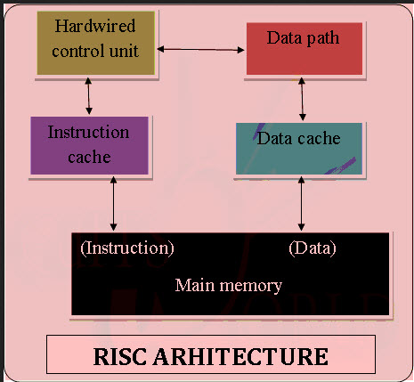

# Investigación de computador.
1. Un computador es una máquina digital que realiza tareas específicas, esto se hace procesando datos para convertirlos en información más comprensible para nosotros mediante una interfaz gráfica.

2. ### Arquitecturas CISC y RISC.

|CISC |RISC |
|-----|-----|
|La arquitectura CISC minimiza el número de instrucciones a costa de los ciclos por instrucción. Los ordenadores con esta arquitectura están diseñados para disminuir el coste de memoria debido a que entre más grande son los programas más memoria consumen, es por esto que se reduce el número de instrucciones por programa. Para reducir el número de instrucciones se incrustan en una sola muy grande, por esto mismo se vuelven muy complejas.|RISC viene de "Set de computación de instrucciones reducidas", este tipo de arquitectura se usa para dispositivos portátiles por la eficiencia energética. En este tipo de microprocesador se utiliza un conjunto de instrucciones optimizado, en este caso se reducen los ciclos por instrucción con menos instrucciones por programa. Una de característica especial de la arquitectura RISC es el "*pipelining*", esto consiste en solapar la ejecución de las instrucciones en forma de "*pipeline*"|

### 3. Hardware

Cuando hablamos de Hardware hablamos de hardware hablamos de la parte física de los computadores.
 
Esta parte se arma con diferentes componentes.

1. El "CPU": El "CPU" o "Unidad central de procesamiento" es aquel que procesa datos y realiza cálculos matemáticos. Hoy en día cuando se habla de "CPU" en realidad hablamos de microprocesadores, ya que estos reemplazaron a las "CPU" con el tiempo. Este componente se encarga de recolectar información, decodificarla y ejecutar instrucciones. 

2. El "*ALU*": La "unidad de lógica aritmética" es una parte del "CPU", la cual se encarga de realizar muchas operaciones aritméticas además de algunas operaciones lógicas entre números o conjuntos. 

3. La unidad de control es uno de los 3 bloques centrales de una "CPU". La función de esta es buscar las instrucciones en la memoria, decodificarlas y ejecutarlas mediante la unidad de procesos.

4. Los registros se encuentran dentro de cada microprocesador y su función es almacenar los valores de datos, comandos, instrucciones o estados binarios que ordenan qué dato debe procesarse, como la forma en la que se debe hacer. Un registro no deja de ser una memoria de velocidad alta y con poca capacidad. Cada registro puede contener una instrucción, una dirección de almacenamiento o cualquier tipo de dato. En un procesador encontramos espacios con una capacidad que oscila entre 4 y 64 bits porque cada registro debe tener un tamaño suficiente para contener una instrucción. En el caso de un ordenador de 64 bit, cada registro debe tener un tamaño de 64 bits.

5. Un bus es una trayectoria por la cual viajan los datos en una computadora para comunicar los distintos dispositivos entre sí. Los principales buses que se encuentran dentro de una PC son: los buses del micro-procesador, los buses de memoria y los buses del sistema. Los del microprocesador son una trayectoria entre el CPU y el CHIPSET y se usan para transmitir datos entre la CPU y el bus principal o entre la CPU y el caché.

6. Memoria: Esta permite acceder a los datos que están almacenados en la computadora pero a corto plazo, es la llamada *"RAM"* pero profundizaremos en ella más adelante.

7. Registro en la memoria:

El Registro de Datos de Memoria (MDR), también conocido como el Búfer de Datos de Memoria (MDB), es un componente de hardware vital dentro de la unidad central de procesamiento (CPU) de una computadora o, a veces, en el propio controlador de memoria. Su función principal es facilitar la comunicación de datos entre la CPU y la memoria principal de la computadora (RAM), actuando como un intermediario crítico que asegura que los datos se transfieran y procesen con precisión. Esta función vital convierte al MDR en una parte indispensable del ciclo de búsqueda-decodificación-ejecución, un ciclo operativo fundamental de la CPU de una computadora.

8. Caché: Consiste en una memoria auxiliar de la CPU en donde se almacenan datos recientemente usados de forma temporal con el fin de poder usarlos con una mayor velocidad. Esto se conoce como una memoria estática de acceso aleatorio o *"SRAM"* la cual es muy veloz y se coloca cerca de la CPU. 

9. RAM: La memoria *"RAM"* es la memoria principal del computador y es un acrónimo del término inglés *"Random access memory"* esta es la principal memoria que usa nuestro computadoy y sirve para almacenar datos de forma temporal para que nuestro procesador pueda acceder a ellos y de esta forma usar los archivos necesarios con rapidez para ejecutar los diferentes programas de nuestro equipo. El término *"Random"* o al azar en español, viene de que se trata de una memoria bidireccional y sin una jerarquía definida para los datos, permitiendo un flujo continuo de los mismos según sea necesario para el procesador. 

10. Memoria secundaria: 

En este caso la memoria secundaria de un computador se refiere a los dispositivos de almacenamiento de datos, aquí van aquellos archivos que no se están usando en el momento y donde se pueden guardar incluso aunque el computador esté apagado, aquí entran los discos duros (HDD), los discos de estado sólido (SSD), las memorias flash (USB), los discos (CD), etc. Cualquier unidad de almacenamiento de datos no volatil. Los datos que se guardan aquí luego deben ser cargados en la memoria principal (RAM) para poder ser procesados por el computador. 

11. Dispositivos de entrada y salida:

En informática, un dispositivo de entrada/salida (E/S) es aquel que permite tanto introducir información a un sistema (entrada) como recibir información desde el sistema (salida). Estos dispositivos juegan un papel crucial en la interacción entre los humanos y las computadoras, así como en la comunicación entre diferentes sistemas.
>(Respuesta generada por la IA Gemini)

12. Los buses de datos: Estos llevan la información desde y hacia el microprocesador y son bidireccionales. También hay bus de direcciones, el cual permite al CPU elegir la posición de la memoria para su lectura o escritura, este es unidireccional ya que es la CPU la que solicita direcciones que son leídas por los periféricos.

### 4. ¿Qué es el software? 

#### A) Software de sistema: 
El software de sistema, también llamado software de base, es el conjunto de programas básicos que administran las funciones mínimas de un sistema informático. Este tipo de software suele venir preinstalado en el computador y tiene como propósito dar soporte a otros tipos de programas informáticos y garantizar el control digital del hardware.

#### B) Software de aplicación:
Es un tipo específico de programas, también llamado “aplicación”, cuya función es permitir al usuario llevar a cabo tareas de distinto tipo y finalidad, como pueden ser trabajos, cálculos, navegación web, videojuegos y cualquier otro fin distinto al mantenimiento del sistema. En esto se diferencia del software de sistema.

#### C) Software de desarrollo:
El software de desarrollo es un conjunto de herramientas, aplicaciones, y marcos de trabajo (frameworks) diseñados para permitir a los programadores y desarrolladores crear, probar, mantener y desplegar software de forma eficiente y efectiva. Este tipo de software engloba desde programas básicos hasta soluciones integradas de alto nivel que facilitan la creación de aplicaciones y sistemas complejos.

### 5 Funcionamiento del computador.

#### A) ¿Qué procesos se llevan a cabo cuando se enciende una computadora? 
Existen 3 tipos de arranque: El arranque de disco duro, arranque de red sin disco y un arranque de mantenimiento.
Nos centraremos en el arranque de disco duro.
1. Se pulsa el botón de encendido.
2. El hardware comienza a funcionar, su primer trabajo consiste en ejecutar el POST (power on self test).

2.2. Cuando el hardware al recibir alimentación comienza a funcionar, su primera tarea consiste en realizar unas pruebas de autodiagnóstico. Si las comprobaciones no encuentran ningún error, el dispositivo reanuda su funcionamiento normal. En el caso de la CPU, una vez que completa su inicialización comienza a cargar instrucciones desde la memoria principal y ejecutarlas. La dirección de memoria a la que la CPU acude por primera vez para cargar instrucciones corresponde a un área de memoria no volátil. En el caso de los PCs este área de memoria corresponde a la BIOS (Basic Input Output System). 

3. Se carga y ejecuta el gestor de arranque.

3.3 El gestor de arranque (bootloader) está almacenado en el MBR (Master Boot Record). La BIOS carga su contenido en memoria principal, y cede el control del sistema, al iniciar su ejecución.

La función principal del gestor de arranque es encontrar la imagen del núcleo, cargarla en memoria principal y comenzar su ejecución. Para ello puede interaccionar con el usuario (permitiendo escoger entre diferentes núcleos alternativos), o incluso alterar la tabla de particiones del disco (para ocultar, hacer visible o cambiar alguna partición).

4. Se carga y ejecuta el sistema operativo.

4.4 Cuando el gestor de arranque carga la imagen del núcleo en memoria principal, cede el control del sistema al núcleo y comienza la ejecución del sistema operativo.

El sistema operativo inicia su propia secuencia de arranque, en la que normalmente detecta y configura el hardware disponible. Después crea el primer proceso siguiendo la ejecución de uno o varios scripts, inicia los servicios que estén configurados.

#### B)¿Qué sucede cuando ingreso un dato en el teclado hasta que lo veo en pantalla?

A cada tecla de un teclado se le asigna un valor único denominado código de tecla, un identificador dependiente del dispositivo para la tecla del teclado. Un teclado genera dos códigos de tecla cuando el usuario pulsa una tecla: uno cuando el usuario presiona la tecla y otro cuando el usuario suelta la tecla.

El controlador de dispositivo de teclado interpreta un código de tecla y lo traduce (asigna) a un código de tecla virtual, un valor independiente del dispositivo definido por el sistema que identifica el propósito de una tecla. Una vez traducido un código de tecla, el diseño del teclado crea un mensaje que incluye el código de tecla, el código de tecla virtual y otra información sobre la pulsación de tecla y, después, coloca el mensaje en la cola de mensajes del sistema. El sistema quita el mensaje de la cola de mensajes del sistema y lo envía a la cola de mensajes del subproceso adecuado. Finalmente, el bucle de mensajes del subproceso quita el mensaje y lo pasa al procedimiento de ventana adecuado para su procesamiento.

Esquema de ejemplo:

#### C) ¿Cómo se codifican los datos internamente en el computador? 
Dentro del ordenador la información se representa en sistema binario, es decir unos y ceros, esto debido a que inicialmente existian 2 estados eléctricos básicos: Tensión y aunsencia de tensión. Estos datos son la unidad básica "BIT" o binary digit.

#### D) ¿Cuáles son las unidades de medida de datos en un computador? 
BIT: Es la unidad mínima de información empleada en informática.

Byte: Equivale a 8 bits. Con dos bytes guardas o procesas una letra.

Kilobyte: 1024 bytes forman un Kilobyte.

Megabyte: Equivale a 1024 Kilobytes. 

Gigabyte: Es igual a 1024 Megabytes. Es la unidad de medida que se suele usar para determinar la capacidad de almacenamiento de las USB.

Terabyte: Lo componen 1024 Gigabytes. Muchas veces esta medida determina la capacidad de almacenamiento de los discos duros.

### Fuentes
¿Qué es un computador? 
>https://edu.gcfglobal.org/es/informatica-basica/encender-el-computador-de-escritorio/1/

Arquitectura CISC Y RISC.
>https://mefics.org/es/qu%C3%A9-es-la-arquitectura-risc-y-cisc-con-sus-ventajas-y-desventajas/

Hardware
> https://concepto.de/cpu/
> https://sistemas.com/alu.php
> https://www.educarte.com.uy/envios/entrega2012set/Reparacion_Unidad%20de%20Control.pdf
> https://www.profesionalreview.com/2019/11/18/registros-del-procesador/
> https://aulavirtual.sld.cu/pluginfile.php/6323/mod_imscp/content/1/sistema-de-buses-en-un-computador.pdf
> https://www.kingston.com/latam/community/articledetail/articleid/29689#:~:text=El%20término%20memoria%20se%20refiere,memoria%20de%20acceso%20aleatorio%20dinámico.
> https://www.vpnunlimited.com/es/help/cybersecurity/memory-data-register?srsltid=AfmBOoq9CDP2fYyCN7vQXtiL6pGWsopgz4B5GrKelF7Xk090_VmSZPmg
> https://ayudaleyprotecciondatos.es/2020/07/23/memoria-cache/
> https://www.intel.com/content/www/us/en/tech-tips-and-tricks/computer-ram.html#:~:text=By-,What%20Is%20RAM%3F,applications%20and%20open%20your%20files.
> https://www-sciencedirect-com.translate.goog/topics/computer-science/secondary-memory?_x_tr_sl=en&_x_tr_tl=es&_x_tr_hl=es&_x_tr_pto=sge#:~:text=La%20memoria%20secundaria%2C%20también%20conocida,más%20costosa%20de%20una%20computadora.

Software
> https://concepto.de/software-de-sistema/
>https://concepto.de/software-de-aplicacion/
>https://desarrollodesoftware.dev/que-es-software-de-desarrollo-y-ejemplos

Funcionamiento del computador
>https://elpuig.xeill.net/Members/vcarceler/c1/didactica/apuntes/ud3/na8
>https://learn.microsoft.com/es-es/windows/win32/inputdev/about-keyboard-input
>https://www.oposinet.com/temario-de-informatica/temario-3-informatica/tema-10-representacin-interna-de-los-datos-2/#:~:text=Dentro%20del%20ordenador%2C%20la%20información,el%20bit%20o%20BInary%20digiT.
>https://edu.gcfglobal.org/es/cultura-tecnologica/medidas-de-almacenamiento-de-informacion/1/

